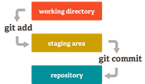
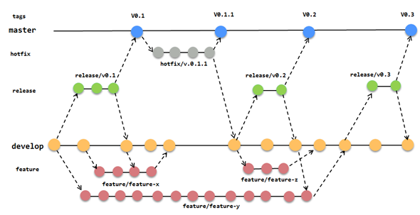

# Día 1

## Conceptos

- Introducción a Git

## Introducción a git

- ¿Qué es Git?

- Puntos claves: trabajo en equipo, histórico de cambios,
  _copia de seguridad_...

- Servicios de repositorios remotos: Github, GitLab, Bitbucket...

- Git por línea de commandos y/o con un cliente gráfico.

## Instalación de herramientas/creación de cuentas

- (Solo para Windows) Descargar [Cmder](https://cmder.net/) y descomprimirlo en
  C: de manera que la ruta del ejecutable principal quedaría
  _C:\\Cmder\\Cmder.exe_. Con esta configuración, puedes añadirlo al menú
  contextual de Windows ejecutando [OpenCmderHere.reg](doc/OpenCmderHere.reg).

- Descargar e instalar el cliente de [Git](https://git-scm.com/).

- Descargar e instalar [Sourcetree](https://www.sourcetreeapp.com/)
  (requiere crear una cuenta de [Atlassian](https://www.atlassian.com/)).

- Crear una cuenta de [GitLab](https://gitlab.com/).

## Configuración del nombre y email que aparecen en los commits

- Esta información aparece en el archivo _.gitconfig_ ubicado en la carpeta
  home del usuario del sistema. Aun así, se recomienda establecerlo mediante la
  línea de comandos como, por ejemplo:
  ```bash
  git config --global user.name "Jose Antonio Postigo"
  git config --global user.email "japostigo@atsistemas.com"
  ```

- Esta información es independiente de las credenciales que se usan para
  conectarse al repositorio.

- Esta información se puede redefinir para repositorios concretos, si se ejecuta
  el comando desde los mismos, pero sin la opción `--global`.
  
## Creación de un repositorio, añadir cambios al _stage_ y commit de modificar un archivo

- Crear una carpeta _ExplicacionRepo1_ con un archivo _README.md_ que contenga:
  ```
  # ExplicacionRepo
  Proyecto para ilustrar el uso de repositorios.
  ```

- Hacer de ese proyecto un repositorio local con:
  ```bash
  git init
  ```
  
- Notar la existencia de la carpta _.git_. Se puede consultar el estado del
  repositorio con:
  ```bash
  git status
  ```

- Efectuar una modificación sobre el archivo _README.md_ creado anteriormente
  y consultar de nuevo el estado del repositorio.
  
- Los archivos de repositorio git pueden estar en uno de los siguientes estados:

  

- Añadir los cambios del archivo _README.md_ al _stage_:
  ```bash
  git add README.md
  ```

- Comprobar de nuevo el estado del repositorio y verificar que _README.md_ está
  _stageado_.

- _Commitear_ los cambios:
  ```bash
  git commit
  ```

- Comprobar de nuevo el estado del repositorio y verificar que no hay nada
  pendiente.

- Abrir el proyecto con Sourcetree para ver el árbol de commits. La manera
  análoga para verlo en la consola es:
  ```bash
  git log
  ```
  pero es poco visual y los desarrolladores usan git por línea de comandos,
  suelen optar por cliente gráficos para visualizar el árbol de commits.

## Añadir varios cambios al stage y commit de adición de archivos

- Crear 3 archivos: _file1.txt_, _file2.txt_ y _file3.txt_ que contengan
  `file1`, `file2` y `file3` respectivamente.

- Modificar el archivo _README.md_ para describir que se han incluido los
  archivos.

- Comprobar el estado del repositorio (hacerlo a partir de ahora en los próximos
  cambios que se efectúen):
  ```bash
  git status
  ```

- Añadir los 4 cambios al stage. Podría ejecutarse un comando git add por cada
  archivo, o en un mismo comando stagear los cambios de los 4 archivos:
  ```bash
  git add README.md file1.txt file2.txt file3.txt
  ```

- _Commitear_ los cambios. Se puede incluir el mensaje en el mismo comando con:
  ```bash
  git commit -m "Added file1.txt, file2.txt and file3.txt"
  ```

- Abrir el proyecto con Sourcetree para ver el árbol de commits.

## Sacar cambios del stage y commit de eliminación de archivos

- Elimina el archivo _file2.txt_ y comprueba el estado del repositorio con:
  ```bash
  git status
  ```

- Como se puede observar, en el _working directory_ queda constancia de la
  eliminación del archivo, sin embargo, esta eliminación no está _stageada_.
  El _stageado_ de la eliminación de un archivo se hace igual que cuando un
  archivo se modifica o se añade:
  ```bash
  git add file2.txt
  ```

- Si se quiere eliminar el archivo _file3.txt_ y además añadir ese cambio al
  _stage_, se puede usar:
  ```bash
  git rm file3.txt
  ```
  Pero hacerlo de esto forma no es lo habitual (esto se explica para conocer la
  existencia del comando).

- Confirmar los últimos movimientos con:
  ```bash
  git status
  ```

- Modificar _file1.txt_ añadiéndole una línea y actualizar el _README.md_ para
  describir el cambio sobre _file1.txt_ y la eliminación de _file2.txt_ y
  _file3.txt_. Luego _stageamos_ todos esos cambios con la ejecución de un único
  comando:
  ```bash
  git add .
  ```

- Llegado a este punto, nos hemos dado cuenta de que, por el motivo que fuese,
  en el commit que estamos preparando no queremos subir _file1.txt_. Para
  sacarlo del _stage_ ejecutamos:
  ```bash
  git reset HEAD file1.txt
  ```

- También tenemos que actualizar _README.md_ para quitar la descripción del
  cambio sobre _file1.txt_. Para hacerlo basta con modificarlo, pero habría que
  volverlo a _stagear_ para que se cuente con el nuevo cambio:
  ```bash
  git add README.md
  ```

- Ya se pueden _commitear_ todos cambios _stageados_:
  ```bash
  git commit -m "Removed file2.txt and file3.txt"
  ```

- Abrir el proyecto con Sourcetree para ver el árbol de commits.

##  Visualizar los cambios y revertir los cambios que se hicieron después del último commit

- Editar _README.md_.

- Comprobar que los cambios están pendientes de ser _stageados_. Podemos ver los
  cambios que se hicieron sobre él con:
  ```bash
  git diff README.md
  ```

- O de todos los archivos que cambiaron con:
  ```bash
  git diff
  ```

- Si hemos cometido un error en _README.md_ que debido a su complejidad no
  sabemos deshacer, podemos deshacerlo según lo que viene en el último commit
  con:
  ```bash
  git checkout -- README.md
  ```

- También se pueden deshacer todos los cambios de todos los archivos NO
  _stageados_, hasta el último commit con:
  ```bash
  git checkout -- .
  ```

- Al comprobar el estado del repositorio se ve que no hay ningún cambio (tampoco
  de _file1.txt_, que también se cambió), y si se comprueban los archivos se
  observa que, efectivamente, está como estaban en el último commit.

- Esta herramienta resulta muy potente cuando, por ejemplo, nos planteamos hacer
  una refactorización de la que podríamos arrepentirnos después de ver el
  resultado.
  
## Establecer el estado del proyecto según un commit concreto

- Con el _working directory_ limpio, abrimos el SourceTree y pulsamos doble
  click sobre el commit al que queremos cambiar. El _working directory_ se
  establecerá según dicho commit.
  
- Esto resulta muy útil cuando, por ejemplo, encontramos un error en una
  funcionalidad que llegó a funcionar correctamente, y queremos identificar en
  qué momento (commit) del desarrollo se afectó.

## .gitignore y .gitkeep

- Crear un archivo _.gitignore_ para ignorar el archivo _generated_ y el
  contenido de las carpetas _www_ y _dependencies_.

- Crear un archivo _generated_. Crear las carpetas _www_ y _dependencies_ e
  incluir algunos archivos en ellas.

- Verificar con `git status` que estos archivos se están ignorando.

- Hacer el cambio oportuno en _.gitignore_ para que el contenido de la carpeta
  _www_ sea ignorado, pero la propia carpeta forme parte del repositorio.

- El archivo _.gitkeep_ que usamos para forzar que la carpeta forme parte del
  repositorio es una convención (y no una herramienta oficialmente soportada
  por Git).

- _Stagear_ y _commitear_ los cambios.

## Conexión con un repositorio remoto

- Crear un repositorio privado vacío en GitLab llamado _ExplicacionRepo_.

- Podemos ver los repositorios remotos asociados a nuestro repositorio local
  con:
  ```bash
  git remote -v
  ```
  Pero en principio no habrá ninguno.

- Asignamos el repositorio remoto con:
  ```bash
  git remote add origin http://...
  ```

- Nota: más adelante veremos que cuando clonamos un repositorio remoto,
  automáticamente se añade su _origin_ remoto.

- Normalmente se trabajará con un único repositorio remoto (_origin_). Pero es
  posible que en un proyecto se trabaje con más de un remoto. Por ejemplo: un
  repositorio remoto de atSistemas donde se aloje el trabajo del día a día y
  otro repositorio remoto del cliente donde solo se suban las entregas.

- Para subir la rama _master_ al repositorio remoto _origin_, ejecutamos el
  comando:
  ```bash
  git push origin master
  ```

- Como ya estamos trabajando en la rama _master_ (porque así lo indica
  `git status`) y solo hay un repositorio remoto (_origin_), bastaría con:
  ```bash
  git push
  ```

- Verificar en Sourcetree que ambos repositorios, local y remoto, están
  actualizados. Verificarlo también en la web de GitLab.
  Observar que el _README.md_ se visualiza formateado desde la web.

## Clonar un repositorio remoto

- Para clonar un repositorio de remoto basta con ejecutar:
  ```bash
  git clone http://...
  ```
  El nombre de la carpeta que se crea coincidirá con el nombre del repositorio.

- Si queremos que, por ejemplo, el nombre de la carpeta local sea concretamente
  _ExplicacionRepo2_, entonces ejecutamos:
  ```bash
  git clone http://... ExplicacionRepo2
  ```

- Ahora disponemos de dos repositorios locales _ExplicacionRepo1_ y
  _ExplicacionRepo2_ apuntando al mismo repositorio remoto. Simularemos de este
  modo como si dos técnicos diferentes estuvieran trabajando sobre el mismo
  proyecto.

## _Pullear_ de un repositorio remoto

- En el proyecto _ExplicacionRepo2_, editamos el archivo _file1.txt_.
  _Commiteamos_ la modificación y la _pusheamos_ a _master_.

- Volvemos al proyecto _ExplicacionRepo1_, que tendría un nuevo cambio en
  remoto. Podríamos conocer su existencia con:
  ```bash
  git fetch
  ```
  En Sourcetree se puede comprobar visualmente el desfase entre las etiquetas
  _master_ (_master_ en local) y _origin/master_ (_master_ en remoto).

- Actualizar el repositorio local con:
  ```bash
  git pull origin master
  ```

- De forma análoga a como ocurría con _push_, como estamos trabajando en la
  misma rama local hacia la que queremos traernos cambios de remoto:
  ```bash
  git pull
  ```

- De nuevo, comprobar en Sourcetree como las etiquetas _master_ y
  _origin/master_ ahora están alineadas en el mismo commit.

## _Mergeo_ de cambios sin conflictos

- En el proyecto _ExplicacionRepo1_, modificar el título del archivo
  _README.md_. _Commitear_ y _pushear_ el cambio.

- En el proyecto _ExplicacionRepo2_, añadir a una línea de descripción al final
  del archivo _README.md_. _Commitear_ y _pushear_ el cambio.

- Como en _ExplicacionRepo2_ aún no está el cambio que se subió desde
  _ExplicacionRepo1_, no nos deja subirlo hasta que no nos actualicemos.

- Nos actualizamos con:
  ```bash
  git pull
  ```
  
- Y luego lo subimos todo con:
  ```bash
  git push
  ```

- Ahora solo queda actualizar _ExplicacionRepo1_.

## _Mergeo_ de cambios con conflictos

- Los conflictos más graves vienen de falta de sincronización en el equipo de
  trabajo. Muchos de ellos podrían evitarse con una buena comunicación.

- En el proyecto _ExplicacionRepo1_, modificar una línea de la descripción.
  _Commitear_ y _pushear_ el cambio.

- En el proyecto _ExplicacionRepo2_, modificar la misma línea de la descripción,
  pero con otro contenido diferente. _Commitear_ y hacer _pull_ de lo que hay en
  remoto. 

- Como ambos técnicos habría trabajado sobre las mismas líneas, esta última
  operación advertiría del conflicto. En git status también se observa.

- Cuando se abre el fichero se ve algo así:
  ```bash
  <<<<<<< HEAD
  (lo que tenemos en local)
  =======
  (lo que hay en remoto)
  >>>>>>> dddc7f0079fc82eaa2d47e5730c378f72ebbbc89
  ```
  Hay que identificar esas líneas conflictivas, resolverlas y, por supuesto,
  eliminar estas líneas especiales que marcan el conflicto.

- Una vez terminemos, se guarda y se realiza el mismo proceso que con un archivo
  modificado: se _stagea_, _commitea_ y _pushea_.

- Volvemos al proyecto _ExplicacionRepo1_ para sincronizarnos.

## Trabajando con ramas

- ¿Qué es una rama de git?

- En el proyecto _ExplicacionRepo1_, crear una rama _develop_ y movernos a ella
  ejecutando:
  ```bash
  git checkout -b develop
  ```

- Crear un archivo _file2.txt_ que contenga file2. _Stagearlo_, _commitearlo_ y
  _pushearlo_ a _develop_.

- Como la rama develop aún no está creada en el repositorio remoto, el comando
  `git push` a secas no funcionará. El propio git nos indica que tendríamos que
  usar:
  ```bash
  git push --set-upstream origin develop
  ```

- Visualizar en Sourcetree la posición de las etiquetas.

- Para ver las ramas existentes en local ejecutamos el comando:
  ```bash
  git branch
  ```

- Para ver todas las ramas existentes en local y en los repositorios remotos:
  ```bash
  git branch -a
  ```
- Ahora que está el working directory limpio, podemos cambiar de rama, a
  _master_ con:
  ```bash
  git checkout master
  ```

- Se puede comprobar como en esta rama aún no está el cambio de _develop_.
  Cuando se consiga una versión estable del desarrollo, se procedería a
  incorporar esos cambios a la rama _master_. Estando en ella, _mergeamos_ lo
  que hay en develop ejecutando:
  ```bash
  git merge develop
  ```

- Y, por último, subir los cambios con:
  ```bash
  git push
  ```

## Stasheando cambios para cambiar de rama rápido

- Cambiar a la rama develop.

- Efectuamos un cambio en el archivo _README.md_, que _stageamos_, _commiteamos_
  y _pusheamos_.

- Luego, volvemos a efectuar otro cambio distinto en el mismo archivo
  _README.md_.

- Resulta que, por necesidades, del proyecto nos piden urgentemente corregir un
  error de _master_. Nos intentamos cambiar a _master_.

- Observamos que no se puede efectuar el cambio de rama porque tenemos trabajo
  en la rama _develop_ actual. Como está a medias y no queremos _commitear_ eso,
  podemos almacenar ese trabajo en una pila temporal _stash_ (no confundir con
  _stage_).

- _Stageamos_ los cambios y los guardamos con:
  ```bash
  git stash
  ```

- En este punto, como ya está el _working directory_ limpio (se puede comprobar
  con `git status`), nos podemos cambiar de rama sin problema.

- Cuando se hayan hecho los cambios oportunos, nos cambiamos de nuevo a
  _develop_ y recuperamos el trabajo que habíamos guardado con:
  ```bash
  git stash pop
  ```
  
## Trabajando con la interfaz gráfica

Los siguientes pasos se harían desde la interfaz gráfica de Sourcetree:

- Clonar el repositorio remoto en una nueva carpeta _ExplicacionRepo3_.

- Cambiar a la rama a _develop_.

- Crear un archivo _file3.txt_ con contenido file3. Eliminar el archivo
  _file2.txt_. Modificar el contenido de _file1.txt_ y de _README.md_.

- Deshacer el cambio que se ha hecho sobre el _README.md_.

- _Stagear_, _commitear_ y _pushear_ esos cambios de _develop_.

- Cambiar la rama a _master_.

- Mergear _develop_ sobre _master_ y _pushear_ los cambios.

- Abrir con Sourcetree _ExplicacionRepo2_ y hacer _pull_ de los cambios.

## Git flow

  

## Ejercicio

- Crear un fork del repositorio de la conjetura de Golbach:
  https://gitlab.com/japostigo-atsistemas/goldbachs-conjecture.

- Clonar el nuevo repositorio (el fork) en local.

- Cambiar a la rama _develop_.

- Crear una rama _feature/refactorization_ (ese es el nombre de la rama,
  incluyendo la barra) que parta de _develop_, que contendrá las modificaciones
  oportunas para que la variable _potentialDivisor_ de la función _isPrime_ pase
  a llamarse simplemente _i_. No subas a remoto esta rama.

- Cuando la rama esté lista, cambia a _develop_ y _mergea_ en _develop_ el
  contenido de la rama _feature/refactorization_.
 
- _Pushea_ _develop_ al repositorio remoto.

- Un matemático del equipo reporta que para comprobar si un número _n_ es primo
  no hace falta comprobar sus divisores hasta _n – 1_, si no que basta con
  hacerlo hasta raíz cuadrada de _n_. Intenta comprender cual es el segmento de
  código en el que habría que hacer ese cambio. Crea una rama
  _hotfix/optimization_ que parta de _master_ que incluya esta modificación.
  No subas a remoto esta rama.

- Cuando la rama esté lista, _mergéala_ sobre _master_.

- Por último, _mergea_ en _máster_ lo que hay en _develop_ y _pushea_ _master_
  al repositorio remoto.
